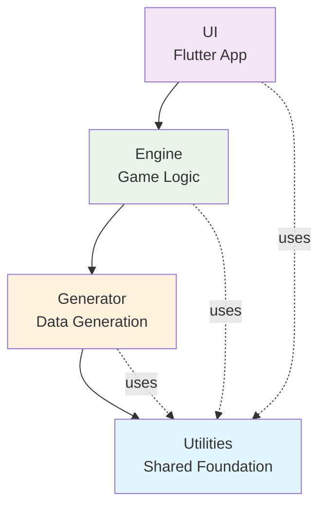

# Soccer Utilities

A shared utilities library for the Soccer Manager project, providing common models, utilities, and data types that can be shared across all modules (engine, generator, ui).

## 🎯 Purpose

The `soccer_utilities` package serves as the foundational layer for the Soccer Manager multi-project workspace. It contains core models and utilities that are used across different modules, ensuring consistency and reducing code duplication.

## 🏗️ Architecture Role

This package sits at the foundation of the Soccer Manager ecosystem:



## 📦 What's Included

### Models

#### Player Model
The core `Player` model represents soccer players with comprehensive attributes:

- **Basic Info**: ID, name, nationality, age, position
- **Skills**: Technical, physical, mental, and positional abilities (0-100 scale)
- **Career**: Club, contract details, market value, reputation
- **Development**: Potential ratings and growth tracking

#### Country Model
Represents countries and regions with:

- **Geographic Data**: Name, continent, FIFA code
- **Soccer Context**: Reputation level for realistic player generation

## 🚀 Quick Start

### Adding to Your Project

Add this dependency to your `pubspec.yaml`:

```yaml
dependencies:
  soccer_utilities:
    path: ../utilities  # Adjust path relative to your project
```

### Basic Usage

```dart
import 'package:soccer_utilities/utilities.dart';

// Create a player
final player = Player(
  id: 'player_001',
  name: 'Lionel Messi',
  age: 36,
  nationality: 'Argentina',
  position: PlayerPosition.rightWing,
  overall: 91,
  potential: 91,
  club: 'Inter Miami',
  // ... other attributes
);

// Create a country
final country = Country(
  name: 'Brazil',
  continent: 'South America',
  fifaCode: 'BRA',
  reputation: CountryReputation.worldClass,
);

// Use in your application logic
print('${player.name} plays for ${player.club}');
print('${country.name} has ${country.reputation.name} reputation');
```

### JSON Serialization

All models support JSON serialization for data persistence:

```dart
// To JSON
final playerJson = player.toJson();
final countryJson = country.toJson();

// From JSON
final playerFromJson = Player.fromJson(playerJson);
final countryFromJson = Country.fromJson(countryJson);
```

## 🔧 Development

### Running Tests

```bash
# Navigate to utilities directory
cd utilities

# Install dependencies
dart pub get

# Run all tests
dart test

# Run specific test file
dart test test/models/player_test.dart
```

### Building

The package uses `json_serializable` for code generation:

```bash
# Generate JSON serialization code
dart run build_runner build

# Watch for changes and auto-generate
dart run build_runner watch
```

### Code Generation

When you modify model classes with `@JsonSerializable()` annotations, you need to regenerate the `.g.dart` files:

```bash
dart run build_runner build --delete-conflicting-outputs
```

## 📚 API Reference

### Exports

The main library exports:

```dart
// Models
export 'src/models/player.dart';      // Player model and enums
export 'src/models/country.dart';     // Country model and enums
```

### Player Enums

- `PlayerPosition`: All soccer positions (goalkeeper, defender, midfielder, forward variants)
- `FootPreference`: left, right, both
- `ContractStatus`: active, expired, pending, terminated

### Country Enums

- `CountryReputation`: unknown, developing, average, good, excellent, worldClass

## 🤝 Integration Examples

### Engine Project

```dart
import 'package:soccer_utilities/utilities.dart';

// Use in match simulation
class MatchSimulator {
  void simulateMatch(List<Player> homeTeam, List<Player> awayTeam) {
    // Access player attributes for simulation logic
    for (final player in homeTeam) {
      final skill = player.overall;
      // ... simulation logic
    }
  }
}
```

### Generator Project

```dart
import 'package:soccer_utilities/utilities.dart';

// Generate players for specific countries
class PlayerGenerator {
  List<Player> generatePlayersForCountry(Country country) {
    return List.generate(25, (index) => Player(
      // ... generate attributes based on country reputation
      nationality: country.name,
    ));
  }
}
```

### UI Project

```dart
import 'package:soccer_utilities/utilities.dart';

// Display player information
class PlayerCard extends StatelessWidget {
  final Player player;
  
  Widget build(BuildContext context) {
    return Card(
      child: ListTile(
        title: Text(player.name),
        subtitle: Text('${player.position.displayName} • ${player.nationality}'),
        trailing: Text('${player.overall}'),
      ),
    );
  }
}
```

## 🧪 Testing

The package includes comprehensive tests for all models:

- **Unit Tests**: Verify model creation, serialization, and validation
- **Property Tests**: Ensure JSON round-trip consistency
- **Edge Cases**: Handle invalid data gracefully

Run the test suite to ensure everything works correctly:

```bash
dart test --coverage
```

## 📋 Contributing

When adding new shared functionality:

1. **Models**: Add to `lib/src/models/` with proper JSON serialization
2. **Utilities**: Add helper functions to appropriate modules
3. **Tests**: Include comprehensive test coverage
4. **Exports**: Update `lib/utilities.dart` to expose new public APIs
5. **Documentation**: Update this README with usage examples

### Code Style

- Follow Dart conventions and use `dart format`
- Use meaningful names and comprehensive documentation
- Include JSON serialization for all data models
- Add Equatable mixing for value equality comparison

## 🔄 Version History

- **1.0.0+1**: Initial release with Player and Country models
  - Core player attributes and skills system
  - Country data with reputation levels
  - JSON serialization support
  - Comprehensive test coverage

---

This utilities package forms the foundation of the Soccer Manager project, enabling consistent data structures and shared functionality across all modules. For questions or contributions, refer to the main project documentation.
